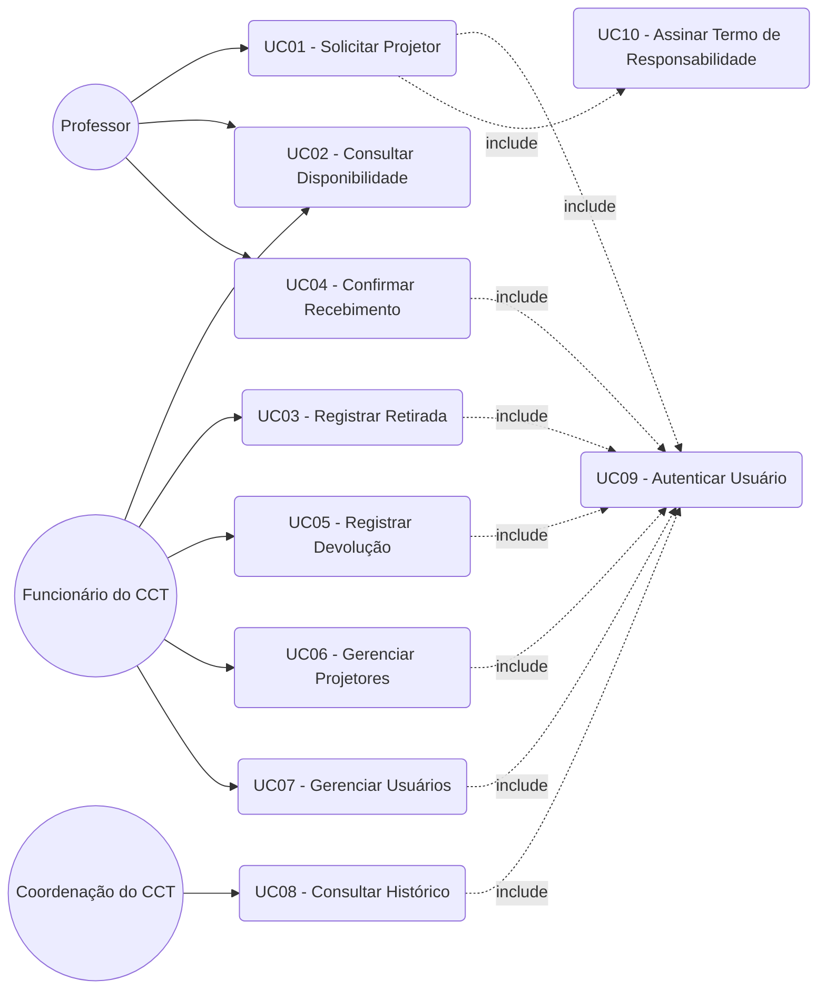
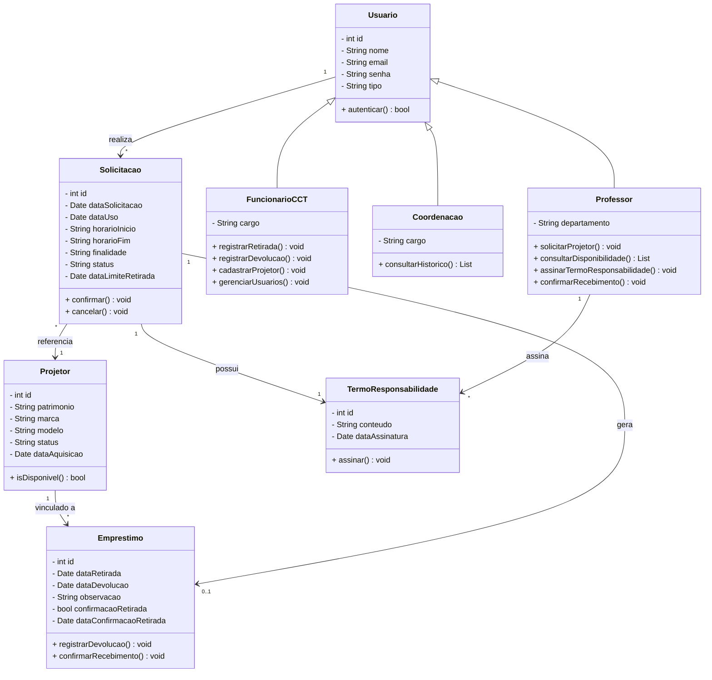
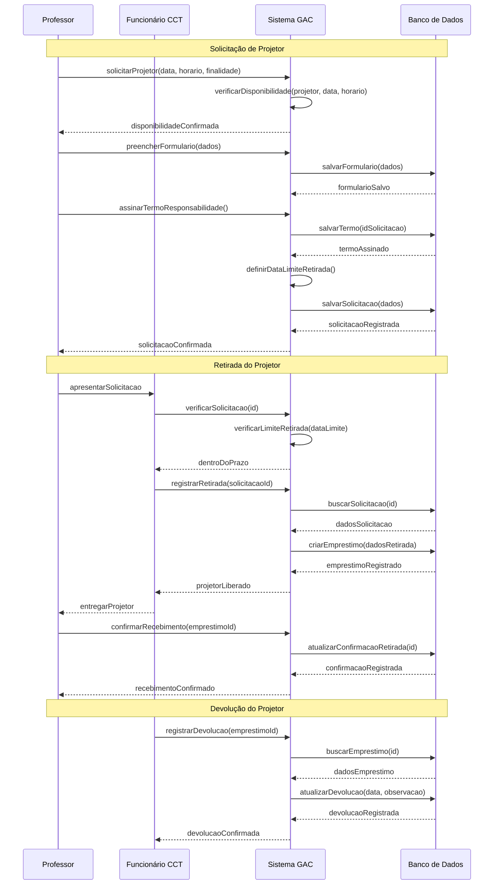

# Visão da Demanda (VD)

## Histórico de Versões

| Data | Versão | Descrição | Autor |
| --- | --- | --- | --- |
| 12/05/2026| 1.0 | Criação inicial do documento de visão da demanda | Bruno Magalhaes |
| 23/05/2026| 1.1 | Integração de formulários, termo de responsabilidade, limite de retirada e confirmação de recebimento nos diagramas | Equipe Dois |

## 1. Objetivo

O propósito deste projeto é desenvolver um sistema digital para automatizar e otimizar o processo de locação e devolução de projetores da universidade, reduzindo o uso de processos manuais e aumentando a eficiência no gerenciamento dos equipamentos.

## 2. Proposta de Valor

O projeto propõe a digitalização e automação do processo de locação de projetores na universidade, substituindo o controle manual por digital.

Com a solução, professores e funcionários poderão realizar solicitações de forma remota e mais ágil, eliminando a necessidade de filas e reduzindo o tempo de atendimento, além de melhorar a organização e o controle dos equipamentos.

## 3. Descrição da Demanda

Atualmente, o processo de locação e devolução de projetores na universidade é realizado de forma manual, por meio de formulários físicos, o que torna o procedimento mais lento, suscetível a erros e de difícil controle administrativo.

O sistema proposto tem como objetivo informatizar esse processo, permitindo o cadastro de projetores, professores e funcionários, além da realização de solicitações de forma digital via web ou aplicativo.

A solução também possibilitará o controle de empréstimos, registro de devoluções e geração de relatórios para o setor administrativo, facilitando a gestão dos equipamentos.

## 4. Partes Interessadas

| Nome | Papel | Responsabilidades | Representante |
| --- | --- | --- | --- |
| Centro de Ciências Tecnológicas (CCT) | Cliente / Gestor | Gerenciar o fluxo de empréstimos, disponibilizar os projetores e supervisionar o processo de locação e devolução | - |
| Professor | Usuário final | Solicitar, utilizar e devolver projetores por meio do sistema | - |
| Professor Orientador | Stakeholder acadêmico | Acompanhar o desenvolvimento do projeto e avaliar os entregáveis | Prof. Marcelo Bezerra |
| Equipe de Desenvolvimento | Desenvolvedores | Projetar, implementar e manter o sistema | Equipe Dois |

## 5. Personas

### 5.1. Professor
Docente da universidade que solicita projetores para uso em aulas e apresentações.

### 5.2. Funcionário do CCT
Servidor responsável por gerenciar o empréstimo e devolução dos projetores, realizando o controle operacional dos equipamentos.

### 5.3. Coordenação do CCT
Responsável pela gestão do processo de locação e supervisão do uso dos projetores.

## 6. Necessidades e Funcionalidades

### Necessidade 1: Solicitar projetor

#### F1.1 Cadastro de solicitação de projetor

- **Descrição:** Permite ao professor solicitar a reserva de um projetor para uso em determinada data e horário, preenchendo formulário com dados da solicitação.
- **Incluída**
- **Atores:** Professor
- **Frequência:** Alta
- **Valor:** Alto

#### F1.2 Assinatura de termo de responsabilidade

- **Descrição:** Permite ao professor assinar digitalmente o termo de responsabilidade vinculado à solicitação do projetor, assumindo os deveres de uso e devolução.
- **Incluída**
- **Atores:** Professor
- **Frequência:** Alta
- **Valor:** Alto

---

### Necessidade 2: Controle de disponibilidade

#### F2.1 Consulta de disponibilidade de projetores

- **Descrição:** Permite visualizar quais projetores estão disponíveis ou em uso no momento.
- **Incluída**
- **Atores:** Professor, Funcionário do CCT
- **Frequência:** Alta
- **Valor:** Alto

---

### Necessidade 3: Gerenciar empréstimos

#### F3.1 Registro de retirada de projetor

- **Descrição:** Permite registrar a entrega de um projetor ao professor responsável pela solicitação, verificando se a retirada está dentro do prazo limite estabelecido.
- **Incluída**
- **Atores:** Funcionário do CCT
- **Frequência:** Alta
- **Valor:** Alto

#### F3.2 Confirmação de recebimento do projetor

- **Descrição:** Permite ao professor confirmar que recebeu o projetor em mãos no momento da retirada.
- **Incluída**
- **Atores:** Professor
- **Frequência:** Alta
- **Valor:** Alto

#### F3.3 Registro de devolução de projetor

- **Descrição:** Permite registrar a devolução do projetor após o uso.
- **Incluída**
- **Atores:** Funcionário do CCT
- **Frequência:** Alta
- **Valor:** Alto

---

### Necessidade 4: Gerenciar equipamentos

#### F4.1 Cadastro e manutenção de projetores

- **Descrição:** Permite cadastrar, editar e remover projetores do sistema.
- **Incluída**
- **Atores:** Funcionário do CCT / Administração
- **Frequência:** Média
- **Valor:** Alto

---

### Necessidade 5: Acompanhar histórico

#### F5.1 Consulta de histórico de empréstimos

- **Descrição:** Permite visualizar o histórico de uso dos projetores, incluindo datas de empréstimo e devolução.
- **Incluída**
- **Atores:** Coordenação do CCT
- **Frequência:** Média
- **Valor:** Médio

## 7. Diagramas UML

Os diagramas abaixo foram desenvolvidos em **Mermaid**, que renderiza diretamente no VS Code (com `Ctrl+Shift+V` para preview) e nativamente no GitHub.

### 7.1. Diagrama de Casos de Uso

Ilustra os atores do sistema e suas interações com as funcionalidades principais.

**Descrição dos Casos de Uso:**

| Código | Nome | Ator Principal | Descrição |
|--------|------|----------------|-----------|
| UC01 | Solicitar Projetor | Professor | Permite ao professor solicitar reserva de um projetor informando data, horário, finalidade, preenchendo formulário e assinando termo de responsabilidade |
| UC02 | Consultar Disponibilidade | Professor, Funcionário | Permite visualizar quais projetores estão disponíveis para uso |
| UC03 | Registrar Retirada | Funcionário do CCT | Registra a entrega de um projetor vinculado a uma solicitação, verificando o prazo limite de retirada |
| UC04 | Confirmar Recebimento | Professor | Permite ao professor confirmar que recebeu o projetor em mãos no momento da retirada |
| UC05 | Registrar Devolução | Funcionário do CCT | Registra a devolução do projetor após o uso |
| UC06 | Gerenciar Projetores | Funcionário do CCT | Cadastrar, editar e remover projetores do sistema |
| UC07 | Gerenciar Usuários | Funcionário do CCT | Cadastrar e gerenciar professores e funcionários autorizados |
| UC08 | Consultar Histórico | Coordenação do CCT | Visualizar o histórico de locações e devoluções |
| UC09 | Autenticar Usuário | Sistema | Validar credenciais de acesso ao sistema (<<include>>) |
| UC10 | Assinar Termo de Responsabilidade | Professor | Assinar digitalmente o termo de responsabilidade vinculado à solicitação do projetor |

### 7.2. Diagrama de Classes

Apresenta a estrutura estática do sistema, com as classes, atributos, métodos e relacionamentos.

### 7.3. Diagrama de Sequência

Demonstra a interação temporal entre os atores e o sistema para o fluxo completo de solicitação, retirada e devolução de um projetor.

> **Visualização:** No VS Code pressione `Ctrl+Shift+V` para preview. No GitHub os diagramas renderizam automaticamente.

---

## Checklist de Validação do Documento de Visão

- [ ] O objetivo está claro e alinhado ao problema/necessidade?
- [ ] A proposta de valor é mensurável e relevante?
- [ ] Todas as partes interessadas estão listadas com papéis definidos?
- [ ] Existem pelo menos duas personas descritas?
- [ ] Todas as necessidades e funcionalidades estão relacionadas a atores?
- [ ] Há indicação de valor e frequência para cada funcionalidade?
- [ ] A arquitetura está ilustrada (mesmo que de forma simples)?
- [ ] O documento está escrito em linguagem clara e objetiva?

---

> Consulte exemplos e dicas em: [Guia de Elaboração da Visão](../../Elicitacao/VisaoDemanda.md)
