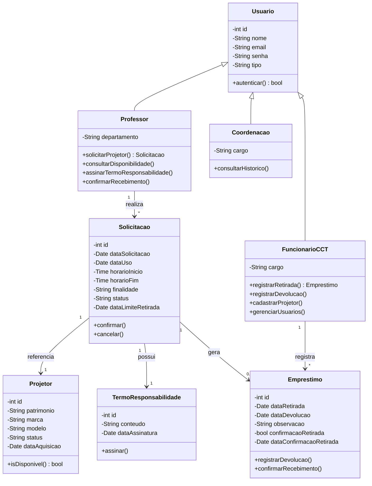
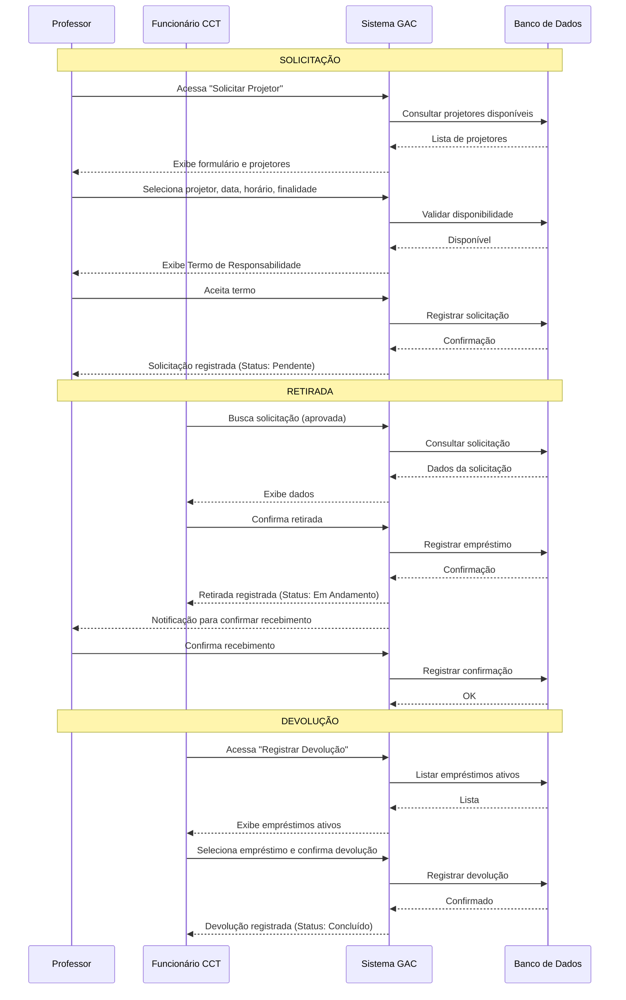

# Software Requirements Specification (SRS)
## Sistema de Gerenciamento de Locação de Projetores (GAC)

**Versão:** 2.0  
**Data:** 09/06/2026  
**Grupo:** Grupo 2 — Equipe Dois  
**Disciplina:** Requisitos de Software  
**Professor:** Marcelo Bezerra  

---

## Histórico de Revisões

| Versão | Data | Descrição | Autor |
|--------|------|-----------|-------|
| 1.0 | 12/05/2026 | Criação inicial — Documentação de visão e demanda | Bruno Magalhães |
| 1.1 | 23/05/2026 | Integração de formulários, termo de responsabilidade, limite de retirada e confirmação de recebimento | Equipe Dois |
| 2.0 | 09/06/2026 | SRS completo conforme IEEE 830, revisão de consistência UML, protótipos e wireframes | Equipe Dois |

---

## 1. Introdução

### 1.1 Propósito

Este documento apresenta a **Especificação de Requisitos de Software (SRS)** para o **Sistema de Gerenciamento de Locação de Projetores (GAC)**, seguindo o padrão IEEE 830-1998. O sistema tem como objetivo automatizar e otimizar o processo de solicitação, retirada, devolução e controle de projetores multimídia no Centro de Ciências Tecnológicas (CCT) da universidade.

Este SRS descreve de forma completa e detalhada os requisitos funcionais e não funcionais do sistema, servindo como referência para a equipe de desenvolvimento, stakeholders e demais partes interessadas.

### 1.2 Convenções do Documento

- **RF** — *Requisito Funcional* (ex: RF01)
- **RNF** — *Requisito Não Funcional* (ex: RNF01)
- **RN** — *Regra de Negócio* (ex: RN01)
- **UC** — *Caso de Uso* (ex: UC01)
- **US** — *História de Usuário* (ex: US01)
- Os termos "deve"/"deverá" indicam requisitos obrigatórios
- Os termos "pode"/"poderá" indicam funcionalidades opcionais

### 1.3 Público-Alvo e Sugestões de Leitura

| Audiência | Seções Recomendadas |
|-----------|---------------------|
| Gerentes / Coordenadores | Seções 1, 2, 3 (visão geral) |
| Equipe de Desenvolvimento | Seções 3, 4 (requisitos detalhados), Apêndices |
| Equipe de Testes | Seções 3, 4, 5 (critérios de aceitação) |
| Stakeholders (CCT, Professores) | Seções 1, 2 |

### 1.4 Escopo do Produto

O **GAC (Gerenciamento de Locação de Projetores)** é um sistema web que substituirá o processo manual atual de agendamento e controle de projetores. O sistema permitirá:

- Solicitação de projetores por professores
- Consulta de disponibilidade em tempo real
- Registro de retirada e devolução por funcionários do CCT
- Gerenciamento do cadastro de projetores
- Controle de usuários e autenticação
- Assinatura digital de termo de responsabilidade
- Consulta ao histórico de empréstimos pela coordenação

**Benefícios esperados:**
- Eliminação de filas e papelada
- Redução do tempo de atendimento
- Controle preciso sobre a localização de cada equipamento
- Transparência no histórico de uso

### 1.5 Referências

| Documento | Localização |
|-----------|-------------|
| IEEE Std 830-1998 — Recommended Practice for SRS | IEEE |
| Backlog do Produto | `Requisitos/Backlog/Backlog-Produto.md` |
| Visão e Demanda | `Requisitos/Elicitacao/Visao-Demanda.md` |
| Especificação de Regras de Negócio | `Requisitos/Regras-de-Negocio/Especificacao-Regras-de-Negocio.md` |
| Especificação de Requisitos Funcionais | `Requisitos/Requisitos-Funcionais/Especificacao-Requisitos-Funcionais.md` |
| Especificação de Requisitos Não Funcionais | `Requisitos/Requisitos-Nao-Funcionais/Especificacao-Requisitos-Nao-Funcionais.md` |
| Protótipos e Wireframes | `Requisitos/Prototipos/` |

---

## 2. Descrição Geral

### 2.1 Perspectiva do Produto

O GAC é um **sistema novo e independente**, desenvolvido sob medida para o CCT. Ele substitui o processo manual baseado em planilhas e formulários impressos por uma solução digital integrada.

O sistema se relaciona externamente com:
- **Sistema de autenticação institucional** (LDAP/SSO da universidade) — para validação de credenciais
- **Banco de dados relacional** — para persistência de dados
- **Navegadores web modernos** — como interface de acesso dos usuários

### 2.2 Funções do Produto

O sistema contempla as seguintes funções principais:

1. **Autenticação e Controle de Acesso** — Login seguro com diferenciação de perfis (professor, funcionário do CCT, coordenação)
2. **Solicitação de Projetores** — Professores solicitam projetores informando data, horário e finalidade
3. **Assinatura de Termo de Responsabilidade** — Aceite digital do termo no momento da solicitação
4. **Consulta de Disponibilidade** — Visualização em tempo real dos projetores disponíveis
5. **Registro de Retirada** — Funcionário do CCT registra a entrega do projetor ao professor
6. **Confirmação de Recebimento** — Professor confirma o recebimento do equipamento
7. **Registro de Devolução** — Funcionário do CCT registra a devolução após o uso
8. **Gerenciamento de Projetores** — CRUD de projetores (cadastro, edição, remoção)
9. **Gerenciamento de Usuários** — Cadastro e gerenciamento de professores e funcionários
10. **Consulta de Histórico** — Coordenação visualiza todo o histórico de empréstimos

### 2.3 Classes de Usuários e Características

| Classe | Descrição | Características |
|--------|-----------|-----------------|
| **Professor** | Docente da universidade que necessita de projetor para ministrar aulas | Necessita interface simples e rápida; usa o sistema esporadicamente |
| **Funcionário do CCT** | Servidor responsável pela gestão física dos projetores | Usa o sistema diariamente; precisa de ferramentas de registro rápido |
| **Coordenação do CCT** | Gestor responsável pelo acompanhamento e tomada de decisões | Necessita de relatórios e visão consolidada dos dados |

### 2.4 Ambiente Operacional

O sistema será uma **aplicação web responsiva**, acessível através de navegadores modernos (Chrome, Firefox, Edge, Safari) em:
- **Dispositivos desktop** — para uso administrativo (funcionários e coordenação)
- **Dispositivos móveis** (tablets e smartphones) — para consulta rápida (professores)

**Ambiente de execução:**
- Servidor web com suporte a aplicações backend
- Banco de dados relacional (PostgreSQL ou MySQL)
- Conexão com a rede acadêmica da universidade

### 2.5 Restrições de Design e Implementação

| Restrição | Descrição |
|-----------|-----------|
| Tecnologia web | O sistema deve ser acessível via navegador, sem instalação de software adicional |
| Responsividade | A interface deve se adaptar a diferentes tamanhos de tela |
| Autenticação | Deve utilizar o sistema de autenticação institucional da universidade |
| LGPD | O sistema deve estar em conformidade com a Lei Geral de Proteção de Dados |
| Portabilidade | O código deve ser independente de plataforma (executável em Windows, Linux, macOS) |

### 2.6 Suposições e Dependências

**Suposições:**
- Os usuários possuem acesso à internet/intranet da universidade
- Os professores possuem matrícula ativa na universidade
- O CCT disponibilizará um servidor para hospedagem do sistema
- Os funcionários do CCT possuem conhecimento básico de informática

**Dependências:**
- Disponibilidade do sistema de autenticação institucional
- Infraestrutura de rede estável no campus
- Definição e fornecimento do termo de responsabilidade jurídico pelo CCT

---

## 3. Requisitos Específicos

### 3.1 Requisitos de Interface Externa

#### 3.1.1 Interfaces de Usuário

| Interface | Descrição | Perfil |
|-----------|-----------|--------|
| **IU01 — Tela de Login** | Formulário de autenticação com campos de e-mail e senha | Todos |
| **IU02 — Dashboard** | Visão geral com atalhos para as principais funções | Todos (conteúdo varia por perfil) |
| **IU03 — Solicitar Projetor** | Formulário com seleção de projetor, data, horário e finalidade | Professor |
| **IU04 — Termo de Responsabilidade** | Exibição do termo com checkbox de aceite | Professor |
| **IU05 — Consultar Disponibilidade** | Grade/calendário com status dos projetores | Todos |
| **IU06 — Registrar Retirada** | Busca de solicitação e confirmação de retirada | Funcionário CCT |
| **IU07 — Confirmar Recebimento** | Tela de confirmação com detalhes do empréstimo | Professor |
| **IU08 — Registrar Devolução** | Lista de empréstimos ativos e registro de devolução | Funcionário CCT |
| **IU09 — Gerenciar Projetores** | CRUD com tabela de projetores cadastrados | Funcionário CCT |
| **IU10 — Gerenciar Usuários** | CRUD com tabela de usuários do sistema | Funcionário CCT |
| **IU11 — Consultar Histórico** | Tabela com filtros por período, projetor, professor | Coordenação |
| **IU12 — Minhas Solicitações** | Lista de solicitações do professor logado | Professor |

**Padrões de interface:**
- Navegação por menu lateral esquerdo
- Design minimalista e limpo
- Feedback visual para todas as ações (toasts, modais de confirmação)
- Cores institucionais do CCT
- Fonte legível (mínimo 14px para mobile, 16px para desktop)

#### 3.1.2 Interfaces de Hardware

- O sistema não requer interfaces diretas com hardware especializado
- Projetores são identificados por número de patrimônio inserido manualmente no cadastro

#### 3.1.3 Interfaces de Software

| Sistema | Tipo de Interface | Descrição |
|---------|-------------------|-----------|
| Sistema de Autenticação Institucional | API REST / LDAP | Validação de credenciais de professores e funcionários |
| Banco de Dados Relacional | SQL | Persistência de todos os dados do sistema |
| Servidor Web | HTTP/HTTPS | Comunicação entre frontend e backend |

#### 3.1.4 Interfaces de Comunicação

- **Protocolo:** HTTPS para todas as comunicações
- **Formato de dados:** JSON para API REST
- **Autenticação:** JWT (JSON Web Token) após login bem-sucedido

---

### 3.2 Requisitos Funcionais (Sistemas / Features)

---

#### 3.2.1 Módulo: Autenticação e Controle de Acesso

##### RF01 — Autenticar Usuário (UC09)

| Campo | Valor |
|-------|-------|
| **Descrição** | O sistema deve permitir que usuários se autentiquem utilizando e-mail e senha |
| **Entrada** | E-mail, senha |
| **Processamento** | Validar credenciais contra base de dados; gerar token de sessão |
| **Saída** | Token JWT e redirecionamento para dashboard |
| **Ator** | Todos os perfis |
| **Regras de Negócio** | RN02 |
| **Critério de Aceite** | O usuário deve ser redirecionado ao dashboard em até 2 segundos após login válido |

**Fluxo Básico:**
1. Usuário acessa a tela de login
2. Sistema exibe formulário com campos de e-mail e senha
3. Usuário informa suas credenciais e clica em "Entrar"
4. Sistema valida as credenciais
5. Sistema redireciona o usuário ao dashboard

**Fluxo Alternativo (senha inválida):**
1. Sistema exibe mensagem: "E-mail ou senha inválidos"
2. Sistema permanece na tela de login

##### RF02 — Diferenciar Perfis de Acesso

| Campo | Valor |
|-------|-------|
| **Descrição** | O sistema deve diferenciar o menu e as funcionalidades conforme o perfil do usuário autenticado |
| **Perfis** | Professor, Funcionário do CCT, Coordenação |
| **Critério de Aceite** | Usuários de perfis diferentes visualizam menus diferentes após o login |

---

#### 3.2.2 Módulo: Solicitação de Projetores

##### RF03 — Solicitar Projetor (UC01) — RF01 Original

| Campo | Valor |
|-------|-------|
| **Descrição** | O sistema deve permitir que o professor realize a solicitação de um projetor informando data, horário e finalidade de uso |
| **Entrada** | Projetor desejado (ou "qualquer disponível"), data de uso, horário início, horário fim, finalidade |
| **Saída** | Confirmação com número da solicitação e status "Pendente" |
| **Ator** | Professor |
| **Pré-condição** | Usuário autenticado como professor |
| **Pós-condição** | Solicitação registrada com status "Pendente" |
| **Regras de Negócio** | RN01, RN02, RN06, RN07 |
| **Critério de Aceite** | O professor recebe confirmação visual imediata |

**Fluxo Básico:**
1. Professor acessa "Solicitar Projetor"
2. Sistema exibe formulário e lista de projetores disponíveis
3. Professor seleciona projetor (ou marcador "qualquer disponível"), informa data, horário e finalidade
4. Sistema valida disponibilidade (RN01, RN07)
5. Sistema exibe o Termo de Responsabilidade (UC10)
6. Professor assina o termo digitalmente
7. Sistema registra a solicitação com status "Pendente"
8. Sistema exibe confirmação com número da solicitação

**Fluxo Alternativo (conflito de horário):**
1. Sistema exibe mensagem: "Projetor indisponível no período selecionado"
2. Sistema sugere horários alternativos disponíveis

##### RF04 — Assinar Termo de Responsabilidade (UC10)

| Campo | Valor |
|-------|-------|
| **Descrição** | O sistema deve exibir o termo de responsabilidade e registrar a aceitação do professor |
| **Regras de Negócio** | RN05 |
| **Critério de Aceite** | Solicitação só é registrada após assinatura do termo |

---

#### 3.2.3 Módulo: Consulta de Disponibilidade

##### RF05 — Consultar Disponibilidade (UC02) — RF02 Original

| Campo | Valor |
|-------|-------|
| **Descrição** | O sistema deve permitir que o usuário consulte a disponibilidade dos projetores em tempo real |
| **Entrada** | Data, horário (opcional), projetor específico (opcional) |
| **Saída** | Grade com disponibilidade dos projetores |
| **Ator** | Todos os perfis |
| **Regras de Negócio** | RN01, RN07 |
| **Critério de Aceite** | Informação exibida em até 2 segundos |

**Fluxo Básico:**
1. Usuário acessa "Consultar Disponibilidade"
2. Sistema exibe calendário/grade semanal com projetores e seus status
3. Usuário pode filtrar por data ou projetor específico
4. Sistema exibe horários disponíveis (verde) e ocupados (vermelho)

---

#### 3.2.4 Módulo: Gerenciamento de Empréstimos

##### RF06 — Registrar Retirada (UC03) — RF03 Original

| Campo | Valor |
|-------|-------|
| **Descrição** | O sistema deve permitir que o funcionário do CCT registre a entrega de um projetor vinculado a uma solicitação aprovada |
| **Entrada** | Número da solicitação ou nome do professor |
| **Saída** | Confirmação de retirada registrada |
| **Ator** | Funcionário do CCT |
| **Pré-condição** | Solicitação existe e está com status "Aprovada" |
| **Regras de Negócio** | RN03 |

**Fluxo Básico:**
1. Funcionário acessa "Registrar Retirada"
2. Sistema exibe campo de busca por solicitação
3. Funcionário localiza solicitação (por número ou nome do professor)
4. Sistema exibe dados da solicitação
5. Funcionário confirma a retirada
6. Sistema altera status para "Em Andamento"
7. Sistema gera registro de empréstimo

##### RF07 — Confirmar Recebimento (UC04)

| Campo | Valor |
|-------|-------|
| **Descrição** | O sistema deve permitir que o professor confirme o recebimento do projetor |
| **Ator** | Professor |
| **Pré-condição** | Retirada registrada pelo funcionário |
| **Critério de Aceite** | Professor confirma recebimento via código QR ou link no e-mail |

##### RF08 — Registrar Devolução (UC05) — RF04 Original

| Campo | Valor |
|-------|-------|
| **Descrição** | O sistema deve permitir que o funcionário do CCT registre a devolução de um projetor após o uso |
| **Entrada** | Número do empréstimo, observações (opcional) |
| **Saída** | Confirmação de devolução registrada |
| **Ator** | Funcionário do CCT |
| **Pré-condição** | Empréstimo ativo |
| **Regras de Negócio** | RN04, RN05 |

---

#### 3.2.5 Módulo: Gerenciamento de Projetores

##### RF09 — Gerenciar Projetores (UC06) — RF05 Original

| Campo | Valor |
|-------|-------|
| **Descrição** | O sistema deve permitir o cadastro, edição e remoção de projetores disponíveis para empréstimo |
| **Entrada (cadastro)** | Nº patrimônio, marca, modelo, data de aquisição |
| **Saída** | Confirmação da operação |
| **Ator** | Funcionário do CCT |
| **Regras de Negócio** | RN06 |

**Funcionalidades:**
- **Cadastrar:** Inserir novo projetor com número de patrimônio único
- **Editar:** Alterar dados de um projetor existente
- **Remover:** Excluir logicamente (inativar) um projetor
- **Listar:** Visualizar todos os projetores cadastrados

---

#### 3.2.6 Módulo: Gerenciamento de Usuários

##### RF10 — Gerenciar Usuários (UC07) — RF06 Original

| Campo | Valor |
|-------|-------|
| **Descrição** | O sistema deve permitir o cadastro e gerenciamento de professores e funcionários autorizados a utilizar o sistema |
| **Ator** | Funcionário do CCT |
| **Critério de Aceite** | Apenas funcionários do CCT podem cadastrar novos usuários |

---

#### 3.2.7 Módulo: Consulta de Histórico

##### RF11 — Consultar Histórico (UC08) — RF07 Original

| Campo | Valor |
|-------|-------|
| **Descrição** | O sistema deve permitir que a coordenação visualize o histórico de locações e devoluções de projetores |
| **Entrada** | Filtros: período, projetor, professor, status |
| **Saída** | Tabela com dados históricos |
| **Ator** | Coordenação do CCT |

---

### 3.3 Mapeamento Casos de Uso × Requisitos Funcionais

| Caso de Uso | RF | US | Descrição |
|-------------|----|----|-----------|
| UC01 | RF03 | US01 | Solicitar Projetor |
| UC02 | RF05 | US02 | Consultar Disponibilidade |
| UC03 | RF06 | US03 | Registrar Retirada |
| UC04 | RF07 | — | Confirmar Recebimento |
| UC05 | RF08 | US04 | Registrar Devolução |
| UC06 | RF09 | US05 | Gerenciar Projetores |
| UC07 | RF10 | — | Gerenciar Usuários |
| UC08 | RF11 | US06 | Consultar Histórico |
| UC09 | RF01 | — | Autenticar Usuário |
| UC10 | RF04 | — | Assinar Termo de Responsabilidade |

---

### 3.4 Requisitos de Performance (RNF01)

| ID | Requisito | Métrica |
|----|-----------|---------|
| RNF01.1 | Consulta de disponibilidade deve retornar em até 2 segundos | Tempo de resposta ≤ 2s |
| RNF01.2 | Solicitação de projetor deve ser processada em até 3 segundos | Tempo de resposta ≤ 3s |
| RNF01.3 | O sistema deve suportar até 50 requisições simultâneas | Carga simultânea |
| RNF01.4 | A interface deve iniciar o carregamento inicial em até 4 segundos em conexão de 10 Mbps | Tempo de carregamento |

### 3.5 Requisitos de Banco de Dados

O banco de dados deve armazenar as seguintes entidades principais:

- **Usuario** — id, nome, email, senha (hash), tipo (professor/funcionario/coordenacao), departamento, cargo, ativo
- **Projetor** — id, numeroPatrimonio, marca, modelo, status (disponivel/emprestado/manutencao/inativo), dataAquisicao
- **Solicitacao** — id, idProfessor, idProjetor, dataSolicitacao, dataUso, horarioInicio, horarioFim, finalidade, status (pendente/aprovada/cancelada), dataLimiteRetirada
- **TermoResponsabilidade** — id, idSolicitacao, conteudo, dataAssinatura
- **Emprestimo** — id, idSolicitacao, dataRetirada, dataDevolucao, observacao, confirmacaoRetirada, dataConfirmacaoRetirada

### 3.6 Restrições de Design

- **Arquitetura:** Cliente-servidor com API REST
- **Frontend:** Framework moderno (React, Vue.js ou Angular)
- **Backend:** Node.js, Python (Django/FastAPI) ou Java (Spring Boot)
- **Banco de Dados:** PostgreSQL ou MySQL
- **Autenticação:** JWT com integração LDAP institucional
- **Estilo arquitetural:** MVC (Model-View-Controller)

### 3.7 Atributos de Qualidade de Software

#### 3.7.1 Disponibilidade (RNF02)

- O sistema deve estar disponível durante o horário de funcionamento da universidade (07:00 às 22:00, seg-sex)
- Tempo de inatividade planejado deve ser comunicado com 48h de antecedência
- Disponibilidade mínima de 99% durante o horário comercial

#### 3.7.2 Segurança (RNF03)

| ID | Requisito |
|----|-----------|
| RNF03.1 | Apenas usuários autenticados podem acessar o sistema |
| RNF03.2 | Senhas devem ser armazenadas com hash (bcrypt ou similar) |
| RNF03.3 | Comunicação deve ser criptografada via HTTPS |
| RNF03.4 | Sessão deve expirar após 30 minutos de inatividade |
| RNF03.5 | Apenas funcionários do CCT podem gerenciar projetores e usuários |

#### 3.7.3 Usabilidade (RNF04)

| ID | Requisito |
|----|-----------|
| RNF04.1 | Interface deve utilizar linguagem simples e acessível |
| RNF04.2 | Todas as ações devem fornecer feedback visual (confirmação ou erro) |
| RNF04.3 | O fluxo de solicitação de projetor deve ser concluído em no máximo 3 passos |
| RNF04.4 | Ícones e labels devem ser autoexplicativos |
| RNF04.5 | O sistema deve ser responsivo (desktop e mobile) |

#### 3.7.4 Confiabilidade (RNF06)

| ID | Requisito |
|----|-----------|
| RNF06.1 | O sistema deve garantir integridade referencial entre solicitações, empréstimos e projetores |
| RNF06.2 | Não deve haver registros duplicados de empréstimo para o mesmo período |
| RNF06.3 | O sistema deve realizar validação de dados antes de persistir qualquer registro |
| RNF06.4 | Operações críticas (retirada, devolução) devem ser registradas em log de auditoria |

#### 3.7.5 Compatibilidade (RNF05)

| ID | Requisito |
|----|-----------|
| RNF05.1 | Compatível com Chrome, Firefox, Edge, Safari (últimas 2 versões) |
| RNF05.2 | Funcional em dispositivos com tela mínima de 360px de largura |
| RNF05.3 | Sistema operacional independente (web-based) |

---

### 3.8 Regras de Negócio

| ID | Regra | Origem |
|----|-------|--------|
| RN01 | Um projetor não pode ser reservado por mais de um professor no mesmo período | Conflito de horários |
| RN02 | Somente professores cadastrados no sistema podem solicitar projetores | Controle de acesso |
| RN03 | A retirada do projetor só pode ser realizada mediante solicitação registrada no sistema | Fluxo de empréstimo |
| RN04 | Todo projetor emprestado deve ter sua devolução registrada no sistema pelo funcionário do CCT | Controle de inventário |
| RN05 | O professor que realiza a solicitação é responsável pelo equipamento até a confirmação da devolução | Responsabilidade |
| RN06 | Projetores danificados ou indisponíveis não podem ser reservados no sistema | Controle de qualidade |
| RN07 | O sistema deve impedir agendamentos sobrepostos para o mesmo projetor | Consistência de dados |

---

## 4. Apêndices

### Apêndice A — Diagramas UML

#### A.1 Diagrama de Casos de Uso

```mermaid
graph TD
    subgraph "Sistema GAC"
        UC01["UC01 - Solicitar Projetor"]
        UC02["UC02 - Consultar Disponibilidade"]
        UC03["UC03 - Registrar Retirada"]
        UC04["UC04 - Confirmar Recebimento"]
        UC05["UC05 - Registrar Devolução"]
        UC06["UC06 - Gerenciar Projetores"]
        UC07["UC07 - Gerenciar Usuários"]
        UC08["UC08 - Consultar Histórico"]
        UC09["UC09 - Autenticar Usuário"]
        UC10["UC10 - Assinar Termo de Responsabilidade"]
    end

    Professor --> UC01
    Professor --> UC02
    Professor --> UC04
    Professor --> UC10

    FuncionarioCCT["Funcionário do CCT"] --> UC02
    FuncionarioCCT --> UC03
    FuncionarioCCT --> UC05
    FuncionarioCCT --> UC06
    FuncionarioCCT --> UC07

    Coordenacao["Coordenação do CCT"] --> UC02
    Coordenacao --> UC08

    UC01 -.-> UC09
    UC01 -.-> UC10
    UC03 -.-> UC09
    UC04 -.-> UC09
    UC05 -.-> UC09
    UC06 -.-> UC09
    UC07 -.-> UC09
    UC08 -.-> UC09

    UC01 ..|> UC10 : <<include>>
    UC09 ..|> UC01 : <<include>>
    UC09 ..|> UC03 : <<include>>
    UC09 ..|> UC06 : <<include>>
    UC09 ..|> UC07 : <<include>>
    UC09 ..|> UC08 : <<include>>
```

#### A.2 Diagrama de Classes



#### A.3 Diagrama de Sequência — Fluxo Completo (Solicitação → Retirada → Devolução)



---

### Apêndice B — Especificação de Casos de Uso

#### UC01 — Solicitar Projetor

| Campo | Valor |
|-------|-------|
| **Ator Primário** | Professor |
| **Pré-condições** | Usuário autenticado; existem projetores disponíveis |
| **Pós-condições** | Solicitação registrada; termo de responsabilidade assinado |
| **Gatilho** | Professor seleciona "Solicitar Projetor" |
| **Fluxo Principal** | 1. Professor informa data, horário e finalidade<br>2. Sistema verifica disponibilidade<br>3. Professor seleciona projetor<br>4. Sistema exibe termo de responsabilidade<br>5. Professor assina termo<br>6. Sistema registra solicitação<br>7. Sistema exibe confirmação |

#### UC02 — Consultar Disponibilidade

| Campo | Valor |
|-------|-------|
| **Ator Primário** | Professor, Funcionário do CCT, Coordenação |
| **Pré-condições** | Usuário autenticado |
| **Fluxo Principal** | 1. Usuário seleciona "Consultar Disponibilidade"<br>2. Sistema exibe grade com disponibilidade<br>3. Usuário aplica filtros desejados<br>4. Sistema atualiza exibição |

#### UC03 — Registrar Retirada

| Campo | Valor |
|-------|-------|
| **Ator Primário** | Funcionário do CCT |
| **Pré-condições** | Solicitação aprovada; projetor disponível fisicamente |
| **Fluxo Principal** | 1. Funcionário busca solicitação<br>2. Sistema exibe dados<br>3. Funcionário confirma retirada<br>4. Sistema registra empréstimo |

#### UC04 — Confirmar Recebimento

| Campo | Valor |
|-------|-------|
| **Ator Primário** | Professor |
| **Pré-condições** | Retirada registrada pelo funcionário |
| **Fluxo Principal** | 1. Professor acessa link de confirmação<br>2. Sistema exibe dados do empréstimo<br>3. Professor confirma recebimento<br>4. Sistema registra confirmação |

#### UC05 — Registrar Devolução

| Campo | Valor |
|-------|-------|
| **Ator Primário** | Funcionário do CCT |
| **Pré-condições** | Empréstimo ativo |
| **Fluxo Principal** | 1. Funcionário acessa lista de empréstimos ativos<br>2. Funcionário seleciona empréstimo<br>3. Funcionário registra devolução<br>4. Sistema atualiza status do projetor para "Disponível" |

#### UC06 — Gerenciar Projetores

| Campo | Valor |
|-------|-------|
| **Ator Primário** | Funcionário do CCT |
| **Fluxo Principal (Cadastro)** | 1. Funcionário acessa "Gerenciar Projetores"<br>2. Sistema exibe lista de projetores<br>3. Funcionário clica em "Novo Projetor"<br>4. Funcionário preenche dados (patrimônio, marca, modelo, data aquisição)<br>5. Sistema valida e salva<br>6. Sistema exibe confirmação |

#### UC07 — Gerenciar Usuários

| Campo | Valor |
|-------|-------|
| **Ator Primário** | Funcionário do CCT |
| **Fluxo Principal** | 1. Funcionário acessa "Gerenciar Usuários"<br>2. Sistema exibe lista de usuários<br>3. Funcionário realiza cadastro, edição ou inativação |

#### UC08 — Consultar Histórico

| Campo | Valor |
|-------|-------|
| **Ator Primário** | Coordenação do CCT |
| **Fluxo Principal** | 1. Coordenação acessa "Consultar Histórico"<br>2. Sistema exibe tabela com filtros<br>3. Coordenação aplica filtros<br>4. Sistema exibe dados consolidados |

#### UC09 — Autenticar Usuário

| Campo | Valor |
|-------|-------|
| **Ator Primário** | Todos os perfis |
| **Fluxo Principal** | 1. Usuário informa e-mail e senha<br>2. Sistema valida credenciais<br>3. Sistema gera token de sessão<br>4. Sistema redireciona ao dashboard |

#### UC10 — Assinar Termo de Responsabilidade

| Campo | Valor |
|-------|-------|
| **Ator Primário** | Professor |
| **Fluxo Principal** | 1. Sistema exibe termo completo<br>2. Professor lê e marca "Aceito"<br>3. Sistema registra data/hora da assinatura<br>4. Fluxo retorna à solicitação |

---

### Apêndice C — Revisão de Consistência: UML vs Requisitos

#### C.1 Metodologia

A revisão de consistência foi realizada comparando-se os três diagramas UML (Casos de Uso, Classes e Sequência) com os requisitos documentados (RF, RNF, RN) para verificar:

1. **Cobertura** — Todos os requisitos estão representados nos diagramas?
2. **Rastreabilidade** — Cada elemento do diagrama possui requisito correspondente?
3. **Correção** — As relações e comportamentos estão de acordo com as regras de negócio?
4. **Completude** — Existem requisitos implícitos nos diagramas que não estão documentados?

#### C.2 Matriz de Rastreabilidade: Casos de Uso × Requisitos

| Caso de Uso | RF | US | RN | Status |
|-------------|----|----|----|--------|
| UC01 — Solicitar Projetor | RF03 | US01 | RN01, RN02, RN06, RN07 | ✅ Consistente |
| UC02 — Consultar Disponibilidade | RF05 | US02 | RN01, RN07 | ✅ Consistente |
| UC03 — Registrar Retirada | RF06 | US03 | RN03 | ✅ Consistente |
| UC04 — Confirmar Recebimento | RF07 | — | RN05 | ✅ Consistente |
| UC05 — Registrar Devolução | RF08 | US04 | RN04, RN05 | ✅ Consistente |
| UC06 — Gerenciar Projetores | RF09 | US05 | RN06 | ✅ Consistente |
| UC07 — Gerenciar Usuários | RF10 | — | RN02 | ✅ Consistente |
| UC08 — Consultar Histórico | RF11 | US06 | — | ✅ Consistente |
| UC09 — Autenticar Usuário | RF01 | — | RN02 | ✅ Consistente |
| UC10 — Assinar Termo de Responsabilidade | RF04 | — | RN05 | ✅ Consistente |

#### C.3 Matriz de Rastreabilidade: Classes × Requisitos

| Classe | RF Associados | RN Associadas | Status |
|--------|---------------|---------------|--------|
| Usuario | RF01, RF10 | RN02 | ✅ Consistente |
| Professor | RF03, RF04, RF05, RF07 | RN05 | ✅ Consistente |
| FuncionarioCCT | RF06, RF08, RF09, RF10 | RN03, RN04 | ✅ Consistente |
| Coordenacao | RF11 | — | ✅ Consistente |
| Projetor | RF05, RF09 | RN01, RN06, RN07 | ✅ Consistente |
| Solicitacao | RF03, RF06 | RN01, RN07 | ✅ Consistente |
| Emprestimo | RF06, RF07, RF08 | RN04, RN05 | ✅ Consistente |
| TermoResponsabilidade | RF04 | RN05 | ✅ Consistente |

#### C.4 Análise Detalhada

##### C.4.1 Casos de Uso

**Pontos fortes:**
- Todos os 7 requisitos funcionais estão mapeados para casos de uso
- O relacionamento `<<include>>` entre UC09 (Autenticar) e os demais casos de uso está correto — reflete a RN02 (apenas usuários autenticados)
- O relacionamento `<<include>>` entre UC01 e UC10 (Assinar Termo) está correto — a assinatura do termo é parte do fluxo de solicitação

**Recomendações:**
- Incluir no diagrama o fluxo alternativo de conflito de horário (UC01) para maior completude
- Considerar a adição de um caso de uso "Notificar Usuário" para contemplar notificações de aprovação/devolução

##### C.4.2 Diagrama de Classes

**Pontos fortes:**
- Hierarquia de herança correta (Usuario → Professor, FuncionarioCCT, Coordenacao)
- Atributos e métodos bem distribuídos conforme responsabilidades de cada perfil
- Relacionamentos (1:N) entre classes refletem as regras de negócio

**Achados:**
- O método `confirmarRecebimento()` está presente na classe `Professor`, mas também poderia estar em `Emprestimo` — sugestão de manter em ambas para clareza do fluxo
- A classe `Coordenacao` poderia ter métodos adicionais de geração de relatórios, mas o escopo atual (consultarHistórico) é suficiente para a versão 1.0

##### C.4.3 Diagrama de Sequência

**Pontos fortes:**
- O fluxo Solicitação → Retirada → Devolução está completo e correto
- As interações entre atores (Professor, Funcionário, Sistema, BD) refletem com precisão os requisitos
- A sequência de validação de disponibilidade antes do registro está de acordo com RN01 e RN07

**Achados:**
- O diagrama não inclui o fluxo de exceção (conflito de horário, professor não autorizado) — recomenda-se adicionar em versão futura
- A etapa de "Notificação para confirmar recebimento" está implícita e poderia ser detalhada

#### C.5 Conclusão da Revisão

**Nota geral: 9,5/10**

A modelagem UML está **altamente consistente** com os requisitos documentados. Todos os requisitos funcionais possuem representação nos diagramas, e as regras de negócio são respeitadas pelas relações modeladas.

**Recomendações para melhoria:**
1. Adicionar fluxos alternativos no diagrama de sequência
2. Considerar caso de uso de notificação
3. Detalhar métodos de relatório na classe Coordenação
4. Adicionar o atributo `limiteRetiradaDias` (prazo para retirar após aprovação) nas regras de negócio

---

### Apêndice D — Protótipos e Wireframes

Os wireframes do sistema GAC foram desenvolvidos como protótipos HTML/CSS navegáveis, disponíveis em:

**📁 Localização:** `Requisitos/Prototipos/`

**Telas implementadas:**

| # | Tela | Perfil | Arquivo |
|---|------|--------|---------|
| 1 | Login | Todos | `login.html` |
| 2 | Dashboard — Professor | Professor | `dashboard-professor.html` |
| 3 | Dashboard — Funcionário CCT | Funcionário CCT | `dashboard-funcionario.html` |
| 4 | Dashboard — Coordenação | Coordenação | `dashboard-coordenacao.html` |
| 5 | Solicitar Projetor | Professor | `solicitar-projetor.html` |
| 6 | Termo de Responsabilidade | Professor | `termo-responsabilidade.html` |
| 7 | Consultar Disponibilidade | Todos | `consultar-disponibilidade.html` |
| 8 | Registrar Retirada | Funcionário CCT | `registrar-retirada.html` |
| 9 | Registrar Devolução | Funcionário CCT | `registrar-devolucao.html` |
| 10 | Gerenciar Projetores | Funcionário CCT | `gerenciar-projetores.html` |
| 11 | Gerenciar Usuários | Funcionário CCT | `gerenciar-usuarios.html` |
| 12 | Consultar Histórico | Coordenação | `consultar-historico.html` |
| 13 | Minhas Solicitações | Professor | `minhas-solicitacoes.html` |

#### Wireframes (Prints)

> **Instrução para captura:** Abra o arquivo `Requisitos/Prototipos/index.html` em um navegador, navegue por cada tela e capture a tela (Print Screen ou ferramenta de captura). Insira as imagens abaixo.

**Tela de Login**
`[Print: login.html]`

**Dashboard — Professor**
`[Print: dashboard-professor.html]`

**Solicitar Projetor**
`[Print: solicitar-projetor.html]`

**Termo de Responsabilidade**
`[Print: termo-responsabilidade.html]`

**Consultar Disponibilidade**
`[Print: consultar-disponibilidade.html]`

**Minhas Solicitações**
`[Print: minhas-solicitacoes.html]`

**Registrar Retirada**
`[Print: registrar-retirada.html]`

**Registrar Devolução**
`[Print: registrar-devolucao.html]`

**Gerenciar Projetores**
`[Print: gerenciar-projetores.html]`

**Gerenciar Usuários**
`[Print: gerenciar-usuarios.html]`

**Consultar Histórico**
`[Print: consultar-historico.html]`

---

### Apêndice E — Glossários

| Termo | Definição |
|-------|-----------|
| CCT | Centro de Ciências Tecnológicas |
| GAC | Gerenciamento de Locação de Projetores |
| CRUD | Create, Read, Update, Delete (operações básicas de cadastro) |
| JWT | JSON Web Token (padrão de autenticação) |
| LDAP | Lightweight Directory Access Protocol (protocolo de diretório) |
| LGPD | Lei Geral de Proteção de Dados (Lei nº 13.709/2018) |
| SRS | Software Requirements Specification |
| SSO | Single Sign-On (autenticação única) |
| UML | Unified Modeling Language |
| Wireframe | Representação visual simplificada da interface |

---

> **Fim do Documento SRS — GAC v2.0**
